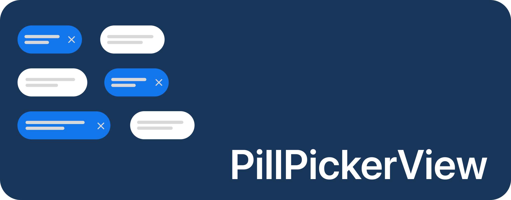
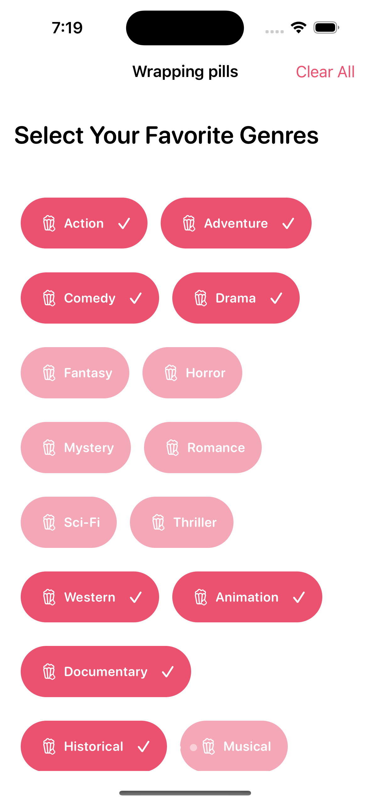

# PillPickerView

A SwiftUI library to present a Pill Picker view

- Highly customizable: PillPickerView offers a wide range of customization options to tailor the appearance of the pills to your needs. You can customize the font, border color, animation, width, height, corner radius, and color scheme of the pills.

- Easy integration: PillPickerView seamlessly integrates with SwiftUI, making it simple to add the pill picker to your SwiftUI-based app.

- Select multiple pills: You can select multiple pills simultaneously, and the library provides smooth transitions when adding or removing pills from the selection.

- Simple API: PillPickerView follows a straightforward API design, making it easy to use. It automatically adjusts the layout of pills to fit within the available space horizontally.

- Compatibility: Supports iOS 14+, macOS 11+

- Lightweight and dependency-free: The library has a lightweight structure and does not have any external dependencies, minimizing its impact on your app's size and performance.

<br>

## How it looks

<div style="display:flex; justify-content: center;">
    <div>
        <h4>Static placement</h4>
        
    </div>
    <div>
        <h4>Flowing placement</h4>
        
    </div>
</div>

<br>

Demo: 
https://github.com/adisve/PillPickerView/assets/96535657/4f052e75-36f1-4f59-9664-0a187b07de28

<br>

## 📀 Installation
Requires iOS 14+. PillPickerView can be installed through the [Swift Package Manager](https://developer.apple.com/documentation/swift_packages/adding_package_dependencies_to_your_app) (recommended) or [Cocoapods](https://cocoapods.org/).

<table>
<tr>
<td>
<strong>
Swift Package Manager
</strong>
<br>
Add the Package URL:
</td>
<td>
<strong>
Cocoapods
</strong>
<br>
Add this to your Podfile:
</td>
</tr>
  
<tr>
<td>
<br>

```
https://github.com/adisve/PillPickerView
```
</td>
<td>
<br>

```
pod 'PillPickerView'
```
</td>
</tr>
</table>

<br>

## 🧑‍💻 Usage

Creating a PillPickerView

To create a pill picker, you need to follow these steps:

- Define a struct or enum that conforms to the Pill protocol. This protocol requires implementing the title property, which represents the title of each pill, as well as requiring the object to be Equatable and Hashable.

- In your SwiftUI view, create a @State or @Binding variable to hold the selected pills. For example:

```swift
@State private var selectedPills: [YourPillType] = []
```

<br>

Instantiate a PillPickerView by providing the necessary parameters, such as the list of items and the selected pills binding:

```swift
PillPickerView(
    items: yourItemList,
    selectedPills: $selectedPills
)
```

<br>

Here's an example usage of PillPickerView in a SwiftUI view:

```swift
import PillPickerView

struct ContentView: View {
    @State private var selectedPills: [YourPillType] = []

    var body: some View {
        VStack {
            // Your other content here
            
            PillPickerView(
                items: yourItemList,
                selectedPills: $selectedPills
            )
            
            // Your other content here
        }
    }
}
```

In the example above, replace YourPillType with your custom pill type and yourItemList with an array of items conforming to the Pill protocol.

<br>

## ✨ Customization

PillPickerView offers a range of customization options to tailor the appearance of the pills to your app's design. You can customize the font, colors, animation, size, and other visual aspects of the pills by using the available modifier functions. 

The PillPickerView includes a wrapping mechanism that automatically adjusts the layout of pills to fit within the available space. If the pills exceed the horizontal width of the container, the view wraps the excess pills to a new line. This makes it easy to present a large number of pills without worrying about truncation.

You can customize the appearance of the pills by chaining the available modifier functions on the PillPickerView. For example:

<br>

```swift
PillPickerView(
    items: yourItemList,
    selectedPills: $selectedPills
)
.pillFont(.system(size: 16, weight: .semibold))
.pillSelectedForegroundColor(.white)
.pillSelectedBackgroundColor(.blue)
```

<br>

To switch between the underlying stack style for the content. Choosing `.noWrap` will invariably cause any text inside the pills to be truncated depending on length, as it will automatically be fitted inside the view and not wrap to a new line. Choosing `.wrap` will let the pills be dynamically placed an move in the PillPickerView.

```swift
.pillStackStyle(.noWrap) // Prevents pills from wrapping to a new line and being dynamic
.pillStackStyle(.wrap) // Default value. Allows pills to move in container
```

<br>

To modify the vertical or horizontal spacing in the PillPickerView

```swift
.pillViewVerticalSpacing(10)
.pillViewHorizontalSpacing(5)
```

To change the font of the pills

```swift
.pillFont(.caption)
```

<br>

You can of course chain things together to get a good layout based on your circumstances and requirements.

```swift
.pillFont(.title3)
.pillViewHorizontalSpacing(30)
```

<br>

To change the icon used by each pill when it is 'selected'.
I advise you to choose something that indicates that the pill will no longer be selected if this icon is pressed, as this is the intended behavior.

```swift
.pillSelectedIcon(Image(systemName: "xmark"))
```

<br>

To change the background color of a not selected and selected pill, respectively

```swift
.pillNormalBackgroundColor(.green)
.pillSelectedBackgroundColor(.blue)
```

<br>

To change the foreground color of a not selected and selected pill, respectively

```swift
.pillNormalForegroundColor(.orange)
.pillSelectedForegroundColor(.white)
```

<br>

The height and width of the pills can also be set, but width will be treated as the minimum width of the pills

```swift
.pillWidth(20)
.pillHeight(10)
```

<br>

Corner radius and border color can also be changed easily

```swift
.pillBorderColor(.green)
.pillCornerRadius(40)
```

<br>

You can also change the animation used when a pill is pressed or wrapped to a newline

```swift
.pillAnimation(.easeInOut)
```

<br>

Padding can also be applied

```swift
.pillPadding(10)
```

## License

```
 Created by A. Veletanlic (github.com/adisve) on 5/20/23.
 Copyright © 2023 A. Veletanlic. All rights reserved.

 MIT License

 Copyright (c) 2023 A. Veletanlic

 Permission is hereby granted, free of charge, to any person obtaining a copy
 of this software and associated documentation files (the "Software"), to deal
 in the Software without restriction, including without limitation the rights
 to use, copy, modify, merge, publish, distribute, sublicense, and/or sell
 copies of the Software, and to permit persons to whom the Software is
 furnished to do so, subject to the following conditions:

 The above copyright notice and this permission notice shall be included in all
 copies or substantial portions of the Software.

 THE SOFTWARE IS PROVIDED "AS IS", WITHOUT WARRANTY OF ANY KIND, EXPRESS OR
 IMPLIED, INCLUDING BUT NOT LIMITED TO THE WARRANTIES OF MERCHANTABILITY,
 FITNESS FOR A PARTICULAR PURPOSE AND NONINFRINGEMENT. IN NO EVENT SHALL THE
 AUTHORS OR COPYRIGHT HOLDERS BE LIABLE FOR ANY CLAIM, DAMAGES OR OTHER
 LIABILITY, WHETHER IN AN ACTION OF CONTRACT, TORT OR OTHERWISE, ARISING FROM,
 OUT OF OR IN CONNECTION WITH THE SOFTWARE OR THE USE OR OTHER DEALINGS IN THE
 SOFTWARE.
```

